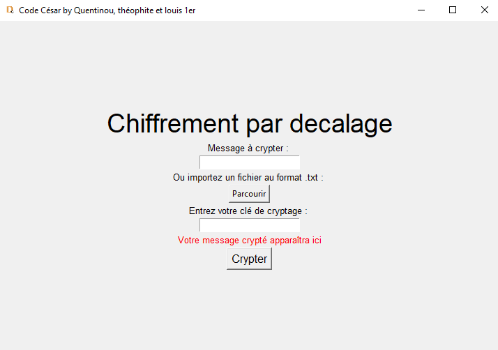

<!-- Web project -->
<!--
*** I'm using markdown "reference style" links for readability.
*** Reference links are enclosed in brackets [ ] instead of parentheses ( ).
*** See the bottom of this document for the declaration of the reference variables
*** for contributors-url, forks-url, etc. This is an optional, concise syntax you may use.
*** https://www.markdownguide.org/basic-syntax/#reference-style-links
-->
<!-- [![Contributors][contributors-shield]][contributors-url]
[![Forks][forks-shield]][forks-url]
[![Stargazers][stars-shield]][stars-url]
[![Issues][issues-shield]][issues-url]
[![MIT License][license-shield]][license-url]
[![LinkedIn][linkedin-shield]][linkedin-url]-->


<!-- PROJECT flask -->
<br />
<p align="center">
  <a href="https://github.com/QuentinDesse/ProjetCryptage">
    
  </a>

  <h3 align="center">Tkinter Cryptage Project</h3>

  <p align="center">
  The repo of the Tkinter Cryptage Project of LP RGI
    <br />
    <a href="https://github.com/QuentinDesse/ProjetCryptage/blob/main/Cesar.pdf"><strong>Explore the docs »</strong></a>
    <br />
    <br />
  </p>
</p>


<!-- TABLE OF CONTENTS -->
## Table of Contents

* [Principe](#Principe)
  * [Built With](#built-with)
* [Getting Started](#getting-started)
  * [Prerequisites macOS/linux](#prerequisites-macoslinux)
  * [Installation & Compilation](#installation--compilation)
* [Improvement](#improvement)
* [Contact](#contact)


<!-- Principe -->
## Principe

In cryptography, shift cipher, also known as the Caesar cipher, is a very simple encryption method used by Julius Caesar in his secret correspondence (which explains the name “Caesar cipher”).
Encrypted text is obtained by replacing each letter of the original clear text with a letter at a fixed distance, always on the same side, in the order of the alphabet. For the last letters (in the case of a right shift), start over.
For example with a shift of 3 to the right, A becomes D, B becomes E, ...
<br>
```diff
A  − → D B  − → E C  − → F ... W  − → Z Y   − → A Z  − → B 
```
<br>
​​This is a circular permutation of the alphabet.

The length of the offset, 3 in the example mentioned, constitutes the encryption key that it suffices to send to the recipient,
if he already knows it's a Caesar cipher, so he can decipher the message.

------------------------------------------------
<table>
    <thead>
        <tr>
            <th align="center">Studens of the project</th>
            <th align="center">Teatchers</th>
            <th align="center">High school Proméo</th>
            <th align="center">Licence Pro</th>
        </tr>
    </thead>
    <tbody>
        <tr>
            <td align="center">Desse Quentin</td>
            <td align="center">Delahaye Samy </td>
            <td align="center"> 240 Avenue Marcel Dassault, 60002 Beauvais</td>
            <td align="center">Réseaux et Genie informatique</td>
        </tr>
        <tr>
            <td align="center">Radde Théo</td>
           <td align="center">Delahaye Samy </td>
            <td align="center"> 240 Avenue Marcel Dassault, 60002 Beauvais</td>
            <td align="center">Réseaux et Genie informatique</td>
        </tr>
        <tr>
            <td align="center">Regnier Louis</td>
            <td align="center">Delahaye Samy </td>
            <td align="center"> 240 Avenue Marcel Dassault, 60002 Beauvais</td>
            <td align="center">Réseaux et Genie informatique</td>
        </tr>
    </tbody>
</table>

### Built With

* [Python](https://www.python.org/)
* [Tkinter](https://docs.python.org/fr/3/library/tkinter.html)


<!-- GETTING STARTED -->
## Getting Started
### Prerequisites macOS/linux

* Create an environment
Create a new python project on _**Visual Studio Code**_

* Install Python
```
$ . brew install python
```

### Installation & Compilation
 
1. Clone the repo
```sh
git clone https://github.com/github_username/Project-Name.git
```
2. Activate Flask
In the dossier 'ProjetCryptage', open Visual, you can compile with the button :
```
start
```


<!-- USAGE EXAMPLES 
## Usage
<p align="center">
  <a href="#">
    
    <a>
  </p> -->


<!-- Improvement -->
## Improvement

Some areas for improvement of the project :

1. Importing and reading a .txt file.
2. Establishment of conditions for the proper functioning of the application with small text reminders.

<!-- CONTACT -->
## Contact
* Student n°1 : [QuentinDesse GIT](https://github.com/QuentinDesse)
* Student n°2 : [ThéoRadde GIT](https://github.com/theoradde)
* Student n°2 : [LouisRegnier linkedin](https://www.linkedin.com/in/louis-regnier-3bb48a121/)


<!-- MARKDOWN LINKS & IMAGES -->
<!-- https://www.markdownguide.org/basic-syntax/#reference-style-links -->
[contributors-shield]: https://img.shields.io/github/contributors/othneildrew/Best-README-Template.svg?style=flat-square
[contributors-url]: https://github.com/othneildrew/Best-README-Template/graphs/contributors
[forks-shield]: https://img.shields.io/github/forks/othneildrew/Best-README-Template.svg?style=flat-square
[forks-url]: https://github.com/othneildrew/Best-README-Template/network/members
[stars-shield]: https://img.shields.io/github/stars/othneildrew/Best-README-Template.svg?style=flat-square
[stars-url]: https://github.com/othneildrew/Best-README-Template/stargazers
[issues-shield]: https://img.shields.io/github/issues/othneildrew/Best-README-Template.svg?style=flat-square
[issues-url]: https://github.com/othneildrew/Best-README-Template/issues
[license-shield]: https://img.shields.io/github/license/othneildrew/Best-README-Template.svg?style=flat-square
[license-url]: https://github.com/othneildrew/Best-README-Template/blob/master/LICENSE.txt
[linkedin-shield]: https://img.shields.io/badge/-LinkedIn-black.svg?style=flat-square&logo=linkedin&colorB=555
[linkedin-url]: https://linkedin.com/in/othneildrew
[product-screenshot]: images/screenshot.png
